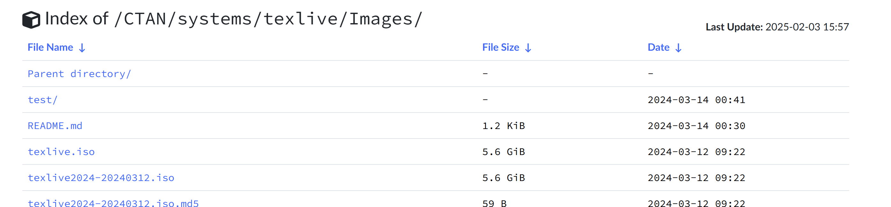
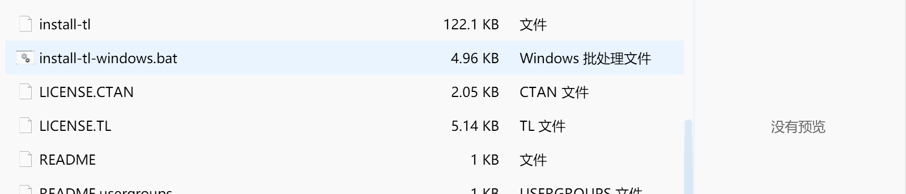

# 配置 LaTex 环境
1. 下载 texlive 编译包
可以在清华大学开源软件镜像站下载
https://mirrors.tuna.tsinghua.edu.cn/CTAN/systems/texlive/Images/
点击下载 texlive.iso

.iso 是光盘映像文件
2.  点击 install-tl-windows.bat 进行安装

3. 配置 vscode 环境
下载插件 latexworkshop
latex 文件后缀为 .tex
4. 添加设置文件
按 F1 点击首选项：打开设置(json)
粘贴下面的代码
    "latex-workshop.latex.tools": [
        {
            "name": "latexmk",
            "command": "latexmk",
            "args": [
                "-synctex=1",
                "-interaction=nonstopmode",
                "-file-line-error",
                "-pdf",
                "%DOC%"
            ]
        },
        {
            "name": "xelatex",
            "command": "xelatex",
            "args": [
                "-synctex=1",
                "-interaction=nonstopmode",
                "-file-line-error",
                "%DOC%"
            ]
        },
        {
            "name": "pdflatex",
            "command": "pdflatex",
            "args": [
                "-synctex=1",
                "-interaction=nonstopmode",
                "-file-line-error",
                "%DOC%"
            ]
        },
        {
            "name": "bibtex",
            "command": "bibtex",
            // "command": "biber",
            "args": [
                // "%DOC%"
                "%DOCFILE%"
            ]
        }
    ],
    "latex-workshop.latex.recipes": [
        {
            "name": "xelatex",
            "tools": ["xelatex"]
        },
        {
            "name": "latexmk",
            "tools": ["latexmk"]
        },
        {
            "name": "pdflatex -> bibtex",
            "tools": ["pdflatex","bibtex"]
        },
        // {
        //     "name": "pdflatex -> bibtex -> pdflatex*2",
        //     "tools": [
        //         "pdflatex",
        //         "bibtex",
        //         "pdflatex",
        //         "pdflatex"
        //     ]
        // },
        {
            "name": "xelatex -> bibtex -> xelatex*2",
            "tools": [
            "xelatex",
            "bibtex",
            "xelatex",
            "xelatex"
            ]

        }
    ],
    //设置在编译完成后所需要删除的文件格式
    "latex-workshop.latex.clean.fileTypes": [
        "*.aux",
        "*.bbl",
        "*.blg",
        "*.idx",
        "*.ind",
        "*.lof",
        "*.lot",
        "*.out",
        "*.toc",
        "*.acn",
        "*.acr",
        "*.alg",
        "*.glg",
        "*.glo",
        "*.gls",
        "*.ist",
        "*.fls",
        "*.log",
        "*.fdb_latexmk"
    ],
     //取消编译出错时的烦人气泡
    "latex-workshop.message.error.show": false,
    "latex-workshop.message.warning.show": false,

    "latex-workshop.showContextMenu": true, //添加LaTex Workshop右键菜单。
    "latex-workshop.intellisense.package.enabled": true, //根据加载的包，自动完成命令或包。  
    "latex-workshop.latex.autoBuild.run": "onSave", //保存文件时自动build（也就是说，点击保存文件或者按快捷键Ctrl+S的时候，除了会保存Tex文件，还会帮你编译LaTex为Pdf。
